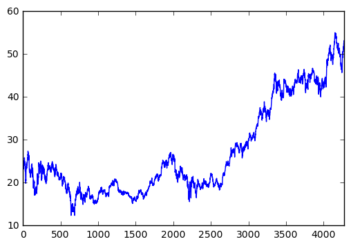
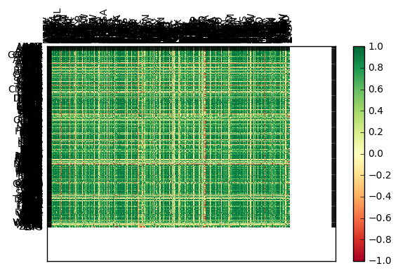

# Automatically getting S&P 500 list


### Pulling up all the libraries
    


```python
import bs4 as bs
import datetime as dt
import os
import pandas as pd
import pandas_datareader.data as web
import pickle ##helps in serializing the object
import requests
import matplotlib.pyplot as plt
from matplotlib import style
import numpy as np
from collections import Counter

from sklearn import svm, cross_validation, neighbors
from sklearn.ensemble import VotingClassifier, RandomForestClassifier
from sklearn.neural_network import MLPClassifier
from sklearn.gaussian_process import GaussianProcessClassifier
from sklearn.gaussian_process.kernels import RBF
from sklearn.tree import DecisionTreeClassifier
from sklearn.ensemble import RandomForestClassifier, AdaBoostClassifier
from sklearn.naive_bayes import GaussianNB
from sklearn.discriminant_analysis import QuadraticDiscriminantAnalysis

```


```python

```

### Pulling data from Wikipedia table


```python
def save_sp500_tickers():
    resp=requests.get('https://en.wikipedia.org/wiki/List_of_S%26P_500_companies')
    soup=bs.BeautifulSoup(resp.text,"lxml")
    
    table=soup.find('table',{'class':'wikitable sortable'})
    tickers=[]
    for row in table.findAll('tr')[1:]:
        ticker=row.findAll('td')[0].text
        tickers.append(ticker)
    
    with open("sp500tickers.pickle","wb") as f:
        pickle.dump(tickers,f)
    return(tickers)

                        
```

### Getting information from Yahoo finance for all the companies


```python
def get_data_from_yahoo(reload_sp500=False):
    if reload_sp500:
        tickers=save_sp500_tickers()
    else:
        with open("sp500tickers.pickle","rb") as f:
            tickers = pickle.load(f) #read bytes
            
    if not os.path.exists('stock_dfs'):
        os.makedirs('stock_dfs')
    
    start = dt.datetime(2000,1,1)
    end=dt.datetime(2016,12,31)
    
    for ticker in tickers:
        print(ticker)
        if not os.path.exists('stock_dfs/{}.csv'.format(ticker)):
            df= web.DataReader(ticker,'yahoo',start, end)
            df.to_csv('stock_dfs/{}.csv'.format(ticker))
        else:
            print('Already have {}'.format(ticker))
                              

```

### Calling the function


```python
get_data_from_yahoo()
```

    MMM
    Already have MMM
    ABT
    Already have ABT
    ABBV
    Already have ABBV
    ACN
    Already have ACN
    ATVI
    Already have ATVI
    AYI
    Already have AYI
    ADBE
    Already have ADBE
    AAP
    Already have AAP
    AES
    Already have AES
    AET
    Already have AET
    AMG
    Already have AMG
    AFL
    Already have AFL
    A
    Already have A
    APD
    Already have APD
    AKAM
    Already have AKAM
    ALK
    Already have ALK
    ALB
    Already have ALB
    AGN
    Already have AGN
    LNT
    Already have LNT
    ALXN
    Already have ALXN
    ALLE
    Already have ALLE
    ADS
    Already have ADS
    ALL
    Already have ALL
    GOOGL
    Already have GOOGL
    GOOG
    Already have GOOG
    MO
    Already have MO
    AMZN
    Already have AMZN
    AEE
    Already have AEE
    AAL
    Already have AAL
    AEP
    Already have AEP
    AXP
    Already have AXP
    AIG
    Already have AIG
    AMT
    Already have AMT
    AWK
    Already have AWK
    AMP
    Already have AMP
    ABC
    Already have ABC
    AME
    Already have AME
    AMGN
    Already have AMGN
    APH
    Already have APH
    APC
    Already have APC
    ADI
    Already have ADI
    ANTM
    Already have ANTM
    AON
    Already have AON
    APA
    Already have APA
    AIV
    Already have AIV
    AAPL
    Already have AAPL
    AMAT
    Already have AMAT
    ADM
    Already have ADM
    ARNC
    Already have ARNC
    AJG
    Already have AJG
    AIZ
    Already have AIZ
    T
    Already have T
    ADSK
    Already have ADSK
    ADP
    Already have ADP
    AN
    Already have AN
    AZO
    Already have AZO
    AVB
    Already have AVB
    AVY
    Already have AVY
    BHI
    Already have BHI
    BLL
    Already have BLL
    BAC
    Already have BAC
    BK
    Already have BK
    BCR
    Already have BCR
    BAX
    Already have BAX
    BBT
    Already have BBT
    BDX
    Already have BDX
    BBBY
    Already have BBBY
    BRK-B
    Already have BRK-B
    BBY
    Already have BBY
    BIIB
    Already have BIIB
    BLK
    Already have BLK
    HRB
    Already have HRB
    BA
    Already have BA
    BWA
    Already have BWA
    BXP
    Already have BXP
    BSX
    Already have BSX
    BMY
    Already have BMY
    AVGO
    Already have AVGO
    BF-B
    Already have BF-B
    CHRW
    Already have CHRW
    CA
    Already have CA
    COG
    Already have COG
    CPB
    Already have CPB
    COF
    Already have COF
    CAH
    Already have CAH
    HSIC
    Already have HSIC
    KMX
    Already have KMX
    CCL
    Already have CCL
    CAT
    Already have CAT
    CBG
    Already have CBG
    CBS
    Already have CBS
    CELG
    Already have CELG
    CNC
    Already have CNC
    CNP
    Already have CNP
    CTL
    Already have CTL
    CERN
    Already have CERN
    CF
    Already have CF
    SCHW
    Already have SCHW
    CHTR
    Already have CHTR
    CHK
    Already have CHK
    CVX
    Already have CVX
    CMG
    Already have CMG
    CB
    Already have CB
    CHD
    Already have CHD
    CI
    Already have CI
    XEC
    Already have XEC
    CINF
    Already have CINF
    CTAS
    Already have CTAS
    CSCO
    Already have CSCO
    C
    Already have C
    CFG
    Already have CFG
    CTXS
    Already have CTXS
    CLX
    Already have CLX
    CME
    Already have CME
    CMS
    Already have CMS
    COH
    Already have COH
    KO
    Already have KO
    CTSH
    Already have CTSH
    CL
    Already have CL
    CMCSA
    Already have CMCSA
    CMA
    Already have CMA
    CAG
    Already have CAG
    CXO
    Already have CXO
    COP
    Already have COP
    ED
    Already have ED
    STZ
    Already have STZ
    GLW
    Already have GLW
    COST
    Already have COST
    COTY
    Already have COTY
    CCI
    Already have CCI
    CSRA
    Already have CSRA
    CSX
    Already have CSX
    CMI
    Already have CMI
    CVS
    Already have CVS
    DHI
    Already have DHI
    DHR
    Already have DHR
    DRI
    Already have DRI
    DVA
    Already have DVA
    DE
    Already have DE
    DLPH
    Already have DLPH
    DAL
    Already have DAL
    XRAY
    Already have XRAY
    DVN
    Already have DVN
    DLR
    Already have DLR
    DFS
    Already have DFS
    DISCA
    Already have DISCA
    DISCK
    Already have DISCK
    DG
    Already have DG
    DLTR
    Already have DLTR
    D
    Already have D
    DOV
    Already have DOV
    DOW
    Already have DOW
    DPS
    Already have DPS
    DTE
    Already have DTE
    DD
    Already have DD
    DUK
    Already have DUK
    DNB
    Already have DNB
    ETFC
    Already have ETFC
    EMN
    Already have EMN
    ETN
    Already have ETN
    EBAY
    Already have EBAY
    ECL
    Already have ECL
    EIX
    Already have EIX
    EW
    Already have EW
    EA
    Already have EA
    EMR
    Already have EMR
    ENDP
    Already have ENDP
    ETR
    Already have ETR
    EVHC
    Already have EVHC
    EOG
    Already have EOG
    EQT
    Already have EQT
    EFX
    Already have EFX
    EQIX
    Already have EQIX
    EQR
    Already have EQR
    ESS
    Already have ESS
    EL
    Already have EL
    ES
    Already have ES
    EXC
    Already have EXC
    EXPE
    Already have EXPE
    EXPD
    Already have EXPD
    ESRX
    Already have ESRX
    EXR
    Already have EXR
    XOM
    Already have XOM
    FFIV
    Already have FFIV
    FB
    Already have FB
    FAST
    Already have FAST
    FRT
    Already have FRT
    FDX
    Already have FDX
    FIS
    Already have FIS
    FITB
    Already have FITB
    FSLR
    Already have FSLR
    FE
    Already have FE
    FISV
    Already have FISV
    FLIR
    Already have FLIR
    FLS
    Already have FLS
    FLR
    Already have FLR
    FMC
    Already have FMC
    FTI
    Already have FTI
    FL
    Already have FL
    F
    Already have F
    FTV
    Already have FTV
    FBHS
    Already have FBHS
    BEN
    Already have BEN
    FCX
    Already have FCX
    FTR
    Already have FTR
    GPS
    Already have GPS
    GRMN
    Already have GRMN
    GD
    Already have GD
    GE
    Already have GE
    GGP
    Already have GGP
    GIS
    Already have GIS
    GM
    Already have GM
    GPC
    Already have GPC
    GILD
    Already have GILD
    GPN
    Already have GPN
    GS
    Already have GS
    GT
    Already have GT
    GWW
    Already have GWW
    HAL
    Already have HAL
    HBI
    Already have HBI
    HOG
    Already have HOG
    HAR
    Already have HAR
    HRS
    Already have HRS
    HIG
    Already have HIG
    HAS
    Already have HAS
    HCA
    Already have HCA
    HCP
    Already have HCP
    HP
    Already have HP
    HES
    Already have HES
    HPE
    Already have HPE
    HOLX
    Already have HOLX
    HD
    Already have HD
    HON
    Already have HON
    HRL
    Already have HRL
    HST
    Already have HST
    HPQ
    Already have HPQ
    HUM
    Already have HUM
    HBAN
    Already have HBAN
    IDXX
    Already have IDXX
    ITW
    Already have ITW
    ILMN
    Already have ILMN
    IR
    Already have IR
    INTC
    Already have INTC
    ICE
    Already have ICE
    IBM
    Already have IBM
    IP
    Already have IP
    IPG
    Already have IPG
    IFF
    Already have IFF
    INTU
    Already have INTU
    ISRG
    Already have ISRG
    IVZ
    Already have IVZ
    IRM
    Already have IRM
    JEC
    Already have JEC
    JBHT
    Already have JBHT
    SJM
    Already have SJM
    JNJ
    Already have JNJ
    JCI
    Already have JCI
    JPM
    Already have JPM
    JNPR
    Already have JNPR
    KSU
    Already have KSU
    K
    Already have K
    KEY
    Already have KEY
    KMB
    Already have KMB
    KIM
    Already have KIM
    KMI
    Already have KMI
    KLAC
    Already have KLAC
    KSS
    Already have KSS
    KHC
    Already have KHC
    KR
    Already have KR
    LB
    Already have LB
    LLL
    Already have LLL
    LH
    Already have LH
    LRCX
    Already have LRCX
    LEG
    Already have LEG
    LEN
    Already have LEN
    LVLT
    Already have LVLT
    LUK
    Already have LUK
    LLY
    Already have LLY
    LNC
    Already have LNC
    LLTC
    Already have LLTC
    LKQ
    Already have LKQ
    LMT
    Already have LMT
    L
    Already have L
    LOW
    Already have LOW
    LYB
    Already have LYB
    MTB
    Already have MTB
    MAC
    Already have MAC
    M
    Already have M
    MNK
    Already have MNK
    MRO
    Already have MRO
    MPC
    Already have MPC
    MAR
    Already have MAR
    MMC
    Already have MMC
    MLM
    Already have MLM
    MAS
    Already have MAS
    MA
    Already have MA
    MAT
    Already have MAT
    MKC
    Already have MKC
    MCD
    Already have MCD
    MCK
    Already have MCK
    MJN
    Already have MJN
    MDT
    Already have MDT
    MRK
    Already have MRK
    MET
    Already have MET
    MTD
    Already have MTD
    KORS
    Already have KORS
    MCHP
    Already have MCHP
    MU
    Already have MU
    MSFT
    Already have MSFT
    MAA
    Already have MAA
    MHK
    Already have MHK
    TAP
    Already have TAP
    MDLZ
    Already have MDLZ
    MON
    Already have MON
    MNST
    Already have MNST
    MCO
    Already have MCO
    MS
    Already have MS
    MOS
    Already have MOS
    MSI
    Already have MSI
    MUR
    Already have MUR
    MYL
    Already have MYL
    NDAQ
    Already have NDAQ
    NOV
    Already have NOV
    NAVI
    Already have NAVI
    NTAP
    Already have NTAP
    NFLX
    Already have NFLX
    NWL
    Already have NWL
    NFX
    Already have NFX
    NEM
    Already have NEM
    NWSA
    Already have NWSA
    NWS
    Already have NWS
    NEE
    Already have NEE
    NLSN
    Already have NLSN
    NKE
    Already have NKE
    NI
    Already have NI
    NBL
    Already have NBL
    JWN
    Already have JWN
    NSC
    Already have NSC
    NTRS
    Already have NTRS
    NOC
    Already have NOC
    NRG
    Already have NRG
    NUE
    Already have NUE
    NVDA
    Already have NVDA
    ORLY
    Already have ORLY
    OXY
    Already have OXY
    OMC
    Already have OMC
    OKE
    Already have OKE
    ORCL
    Already have ORCL
    PCAR
    Already have PCAR
    PH
    Already have PH
    PDCO
    Already have PDCO
    PAYX
    Already have PAYX
    PYPL
    Already have PYPL
    PNR
    Already have PNR
    PBCT
    Already have PBCT
    PEP
    Already have PEP
    PKI
    Already have PKI
    PRGO
    Already have PRGO
    PFE
    Already have PFE
    PCG
    Already have PCG
    PM
    Already have PM
    PSX
    Already have PSX
    PNW
    Already have PNW
    PXD
    Already have PXD
    PBI
    Already have PBI
    PNC
    Already have PNC
    RL
    Already have RL
    PPG
    Already have PPG
    PPL
    Already have PPL
    PX
    Already have PX
    PCLN
    Already have PCLN
    PFG
    Already have PFG
    PG
    Already have PG
    PGR
    Already have PGR
    PLD
    Already have PLD
    PRU
    Already have PRU
    PEG
    Already have PEG
    PSA
    Already have PSA
    PHM
    Already have PHM
    PVH
    Already have PVH
    QRVO
    Already have QRVO
    PWR
    Already have PWR
    QCOM
    Already have QCOM
    DGX
    Already have DGX
    RRC
    Already have RRC
    RTN
    Already have RTN
    O
    Already have O
    RHT
    Already have RHT
    REGN
    Already have REGN
    RF
    Already have RF
    RSG
    Already have RSG
    RAI
    Already have RAI
    RHI
    Already have RHI
    ROK
    Already have ROK
    COL
    Already have COL
    ROP
    Already have ROP
    ROST
    Already have ROST
    RCL
    Already have RCL
    R
    Already have R
    CRM
    Already have CRM
    SCG
    Already have SCG
    SLB
    Already have SLB
    SNI
    Already have SNI
    STX
    Already have STX
    SEE
    Already have SEE
    SRE
    Already have SRE
    SHW
    Already have SHW
    SIG
    Already have SIG
    SPG
    Already have SPG
    SWKS
    Already have SWKS
    SLG
    Already have SLG
    SNA
    Already have SNA
    SO
    Already have SO
    LUV
    Already have LUV
    SWN
    Already have SWN
    SE
    Already have SE
    SPGI
    Already have SPGI
    SWK
    Already have SWK
    SPLS
    Already have SPLS
    SBUX
    Already have SBUX
    STT
    Already have STT
    SRCL
    Already have SRCL
    SYK
    Already have SYK
    STI
    Already have STI
    SYMC
    Already have SYMC
    SYF
    Already have SYF
    SYY
    Already have SYY
    TROW
    Already have TROW
    TGT
    Already have TGT
    TEL
    Already have TEL
    TGNA
    Already have TGNA
    TDC
    Already have TDC
    TSO
    Already have TSO
    TXN
    Already have TXN
    TXT
    Already have TXT
    COO
    Already have COO
    HSY
    Already have HSY
    TRV
    Already have TRV
    TMO
    Already have TMO
    TIF
    Already have TIF
    TWX
    Already have TWX
    TJX
    Already have TJX
    TMK
    Already have TMK
    TSS
    Already have TSS
    TSCO
    Already have TSCO
    TDG
    Already have TDG
    RIG
    Already have RIG
    TRIP
    Already have TRIP
    FOXA
    Already have FOXA
    FOX
    Already have FOX
    TSN
    Already have TSN
    UDR
    Already have UDR
    ULTA
    Already have ULTA
    USB
    Already have USB
    UA
    Already have UA
    UAA
    Already have UAA
    UNP
    Already have UNP
    UAL
    Already have UAL
    UNH
    Already have UNH
    UPS
    Already have UPS
    URI
    Already have URI
    UTX
    Already have UTX
    UHS
    Already have UHS
    UNM
    Already have UNM
    URBN
    Already have URBN
    VFC
    Already have VFC
    VLO
    Already have VLO
    VAR
    Already have VAR
    VTR
    Already have VTR
    VRSN
    Already have VRSN
    VRSK
    Already have VRSK
    VZ
    Already have VZ
    VRTX
    Already have VRTX
    VIAB
    Already have VIAB
    V
    Already have V
    VNO
    Already have VNO
    VMC
    Already have VMC
    WMT
    Already have WMT
    WBA
    Already have WBA
    DIS
    Already have DIS
    WM
    Already have WM
    WAT
    Already have WAT
    WEC
    Already have WEC
    WFC
    Already have WFC
    HCN
    Already have HCN
    WDC
    Already have WDC
    WU
    Already have WU
    WRK
    Already have WRK
    WY
    Already have WY
    WHR
    Already have WHR
    WFM
    Already have WFM
    WMB
    Already have WMB
    WLTW
    Already have WLTW
    WYN
    Already have WYN
    WYNN
    Already have WYNN
    XEL
    Already have XEL
    XRX
    Already have XRX
    XLNX
    Already have XLNX
    XL
    Already have XL
    XYL
    Already have XYL
    YHOO
    Already have YHOO
    YUM
    Already have YUM
    ZBH
    Already have ZBH
    ZION
    Already have ZION
    ZTS
    Already have ZTS
    

### Compile into one large dataframe 
We will take all the Adj Close for our program


```python
def compile_data():
    with open("sp500tickers.pickle","rb") as f:
        tickers= pickle.load(f)
        
    main_df= pd.DataFrame()
    
    for count,ticker in enumerate(tickers):
        df=pd.read_csv('stock_dfs/{}.csv'.format(ticker))
        df.set_index('Date', inplace=True)
        
        df.rename(columns = {'Adj Close': ticker}, inplace=True)
        df.drop(['Open','High','Low','Close','Volume'],1,inplace=True)
        
        if main_df.empty:
            main_df=df
        else:
            main_df= main_df.join(df, how='outer')
            
        if count %10 == 0:
            print(count)
    print(main_df.head())
    main_df.to_csv('sp500_joined_closes.csv')
```


```python
compile_data()
```

    0
    10
    20
    30
    40
    50
    60
    70
    80
    90
    100
    110
    120
    130
    140
    150
    160
    170
    180
    190
    200
    210
    220
    230
    240
    250
    260
    270
    280
    290
    300
    310
    320
    330
    340
    350
    360
    370
    380
    390
    400
    410
    420
    430
    440
    450
    460
    470
    480
    490
    500
                      MMM       ABT  ABBV  ACN      ATVI  AYI       ADBE  AAP  \
    Date                                                                        
    2000-01-03  31.131128  9.517434   NaN  NaN  1.259640  NaN  16.274673  NaN   
    2000-01-04  29.894130  9.245507   NaN  NaN  1.221324  NaN  14.909400  NaN   
    2000-01-05  30.760029  9.228512   NaN  NaN  1.226114  NaN  15.204175  NaN   
    2000-01-06  33.234026  9.551425   NaN  NaN  1.202166  NaN  15.328291  NaN   
    2000-01-07  33.893758  9.653397   NaN  NaN  1.235693  NaN  16.072985  NaN   
    
                      AES       AET ...        XEL        XRX       XLNX  \
    Date                            ...                                    
    2000-01-03  32.346420  6.290820 ...   8.665217  12.447396  35.497325   
    2000-01-04  31.063717  6.184675 ...   8.864745  11.868447  34.690567   
    2000-01-05  31.398335  6.142218 ...   9.206793  12.479560  33.931266   
    2000-01-06  31.649299  6.149294 ...   9.121281  12.222249  30.988975   
    2000-01-07  32.262765  6.552642 ...   9.121281  12.511724  34.500742   
    
                       XL  XYL        YHOO       YUM  ZBH       ZION  ZTS  
    Date                                                                   
    2000-01-03  32.275336  NaN  118.750000  5.302430  NaN  43.646065  NaN  
    2000-01-04  30.822554  NaN  110.750000  5.195849  NaN  41.532573  NaN  
    2000-01-05  31.097404  NaN  102.625000  5.222494  NaN  41.483422  NaN  
    2000-01-06  31.332991  NaN   92.046875  5.178085  NaN  42.073233  NaN  
    2000-01-07  33.414004  NaN  101.812500  5.062622  NaN  42.171535  NaN  
    
    [5 rows x 505 columns]
    

# Company Corelation Table


```python
#trying to just test on a graph that wheher we can plot it or not
def visualize_data():
    df= pd.read_csv('sp500_joined_closes.csv')
    df['VZ'].plot()
    plt.show()
    df_corr = df.corr() ##corellation table of our dataframe
    
    ##print(df_corr.head()) ##display the header for the correlation
    
    data= df_corr.values
    fig = plt.figure()
    ax=fig.add_subplot(1,1,1)
    
    heatmap= ax.pcolor(data, cmap = plt.cm.RdYlGn)
    fig.colorbar(heatmap)
    
    ###building the graphs, it will plot color and we want to tick the marks, we are adding ticks and labels
    ax.set_xticks(np.arange(data.shape[0])+.5, minor= False)
    ax.set_yticks(np.arange(data.shape[1])+.5, minor= False)
    ax.invert_yaxis() ###we do it to remove gap from top of the graph
    ax.xaxis.tick_top()
    
    column_labels = df_corr.columns
    row_labels = df_corr.index
    
    ax.set_xticklabels(column_labels)
    ax.set_yticklabels(row_labels)
    plt.xticks(rotation=90)
    heatmap.set_clim(-1,1)
    plt.tight_layout()
    
    plt.show()
    

```


```python
visualize_data()
```








### Process Data for Machine Learning


```python
def process_data_for_labels(ticker):
    hm_days=7
    df = pd.read_csv('sp500_joined_closes.csv', index_col=0)
    tickers = df.columns.values.tolist()
    df.fillna(0, inplace=True)
    
    for i in range(1, hm_days+1):
        df['{}_{}d'.format(ticker,i)] = (df[ticker].shift(-i)- df[ticker])/df[ticker]


    df.fillna(0, inplace=True)
    return tickers, df

process_data_for_labels('VZ')
```


    (['MMM',
      'ABT',
      'ABBV',
      'ACN',
      'ATVI',
      'AYI',
      'ADBE',
      'AAP',
      'AES',
      'AET',
      'AMG',
      'AFL',
      'A',
      'APD',
      'AKAM',
      'ALK',
      'ALB',
      'AGN',
      'LNT',
      'ALXN',
      'ALLE',
      'ADS',
      'ALL',
      'GOOGL',
      'GOOG',
      'MO',
      'AMZN',
      'AEE',
      'AAL',
      'AEP',
      'AXP',
      'AIG',
      'AMT',
      'AWK',
      'AMP',
      'ABC',
      'AME',
      'AMGN',
      'APH',
      'APC',
      'ADI',
      'ANTM',
      'AON',
      'APA',
      'AIV',
      'AAPL',
      'AMAT',
      'ADM',
      'ARNC',
      'AJG',
      'AIZ',
      'T',
      'ADSK',
      'ADP',
      'AN',
      'AZO',
      'AVB',
      'AVY',
      'BHI',
      'BLL',
      'BAC',
      'BK',
      'BCR',
      'BAX',
      'BBT',
      'BDX',
      'BBBY',
      'BRK-B',
      'BBY',
      'BIIB',
      'BLK',
      'HRB',
      'BA',
      'BWA',
      'BXP',
      'BSX',
      'BMY',
      'AVGO',
      'BF-B',
      'CHRW',
      'CA',
      'COG',
      'CPB',
      'COF',
      'CAH',
      'HSIC',
      'KMX',
      'CCL',
      'CAT',
      'CBG',
      'CBS',
      'CELG',
      'CNC',
      'CNP',
      'CTL',
      'CERN',
      'CF',
      'SCHW',
      'CHTR',
      'CHK',
      'CVX',
      'CMG',
      'CB',
      'CHD',
      'CI',
      'XEC',
      'CINF',
      'CTAS',
      'CSCO',
      'C',
      'CFG',
      'CTXS',
      'CLX',
      'CME',
      'CMS',
      'COH',
      'KO',
      'CTSH',
      'CL',
      'CMCSA',
      'CMA',
      'CAG',
      'CXO',
      'COP',
      'ED',
      'STZ',
      'GLW',
      'COST',
      'COTY',
      'CCI',
      'CSRA',
      'CSX',
      'CMI',
      'CVS',
      'DHI',
      'DHR',
      'DRI',
      'DVA',
      'DE',
      'DLPH',
      'DAL',
      'XRAY',
      'DVN',
      'DLR',
      'DFS',
      'DISCA',
      'DISCK',
      'DG',
      'DLTR',
      'D',
      'DOV',
      'DOW',
      'DPS',
      'DTE',
      'DD',
      'DUK',
      'DNB',
      'ETFC',
      'EMN',
      'ETN',
      'EBAY',
      'ECL',
      'EIX',
      'EW',
      'EA',
      'EMR',
      'ENDP',
      'ETR',
      'EVHC',
      'EOG',
      'EQT',
      'EFX',
      'EQIX',
      'EQR',
      'ESS',
      'EL',
      'ES',
      'EXC',
      'EXPE',
      'EXPD',
      'ESRX',
      'EXR',
      'XOM',
      'FFIV',
      'FB',
      'FAST',
      'FRT',
      'FDX',
      'FIS',
      'FITB',
      'FSLR',
      'FE',
      'FISV',
      'FLIR',
      'FLS',
      'FLR',
      'FMC',
      'FTI',
      'FL',
      'F',
      'FTV',
      'FBHS',
      'BEN',
      'FCX',
      'FTR',
      'GPS',
      'GRMN',
      'GD',
      'GE',
      'GGP',
      'GIS',
      'GM',
      'GPC',
      'GILD',
      'GPN',
      'GS',
      'GT',
      'GWW',
      'HAL',
      'HBI',
      'HOG',
      'HAR',
      'HRS',
      'HIG',
      'HAS',
      'HCA',
      'HCP',
      'HP',
      'HES',
      'HPE',
      'HOLX',
      'HD',
      'HON',
      'HRL',
      'HST',
      'HPQ',
      'HUM',
      'HBAN',
      'IDXX',
      'ITW',
      'ILMN',
      'IR',
      'INTC',
      'ICE',
      'IBM',
      'IP',
      'IPG',
      'IFF',
      'INTU',
      'ISRG',
      'IVZ',
      'IRM',
      'JEC',
      'JBHT',
      'SJM',
      'JNJ',
      'JCI',
      'JPM',
      'JNPR',
      'KSU',
      'K',
      'KEY',
      'KMB',
      'KIM',
      'KMI',
      'KLAC',
      'KSS',
      'KHC',
      'KR',
      'LB',
      'LLL',
      'LH',
      'LRCX',
      'LEG',
      'LEN',
      'LVLT',
      'LUK',
      'LLY',
      'LNC',
      'LLTC',
      'LKQ',
      'LMT',
      'L',
      'LOW',
      'LYB',
      'MTB',
      'MAC',
      'M',
      'MNK',
      'MRO',
      'MPC',
      'MAR',
      'MMC',
      'MLM',
      'MAS',
      'MA',
      'MAT',
      'MKC',
      'MCD',
      'MCK',
      'MJN',
      'MDT',
      'MRK',
      'MET',
      'MTD',
      'KORS',
      'MCHP',
      'MU',
      'MSFT',
      'MAA',
      'MHK',
      'TAP',
      'MDLZ',
      'MON',
      'MNST',
      'MCO',
      'MS',
      'MOS',
      'MSI',
      'MUR',
      'MYL',
      'NDAQ',
      'NOV',
      'NAVI',
      'NTAP',
      'NFLX',
      'NWL',
      'NFX',
      'NEM',
      'NWSA',
      'NWS',
      'NEE',
      'NLSN',
      'NKE',
      'NI',
      'NBL',
      'JWN',
      'NSC',
      'NTRS',
      'NOC',
      'NRG',
      'NUE',
      'NVDA',
      'ORLY',
      'OXY',
      'OMC',
      'OKE',
      'ORCL',
      'PCAR',
      'PH',
      'PDCO',
      'PAYX',
      'PYPL',
      'PNR',
      'PBCT',
      'PEP',
      'PKI',
      'PRGO',
      'PFE',
      'PCG',
      'PM',
      'PSX',
      'PNW',
      'PXD',
      'PBI',
      'PNC',
      'RL',
      'PPG',
      'PPL',
      'PX',
      'PCLN',
      'PFG',
      'PG',
      'PGR',
      'PLD',
      'PRU',
      'PEG',
      'PSA',
      'PHM',
      'PVH',
      'QRVO',
      'PWR',
      'QCOM',
      'DGX',
      'RRC',
      'RTN',
      'O',
      'RHT',
      'REGN',
      'RF',
      'RSG',
      'RAI',
      'RHI',
      'ROK',
      'COL',
      'ROP',
      'ROST',
      'RCL',
      'R',
      'CRM',
      'SCG',
      'SLB',
      'SNI',
      'STX',
      'SEE',
      'SRE',
      'SHW',
      'SIG',
      'SPG',
      'SWKS',
      'SLG',
      'SNA',
      'SO',
      'LUV',
      'SWN',
      'SE',
      'SPGI',
      'SWK',
      'SPLS',
      'SBUX',
      'STT',
      'SRCL',
      'SYK',
      'STI',
      'SYMC',
      'SYF',
      'SYY',
      'TROW',
      'TGT',
      'TEL',
      'TGNA',
      'TDC',
      'TSO',
      'TXN',
      'TXT',
      'COO',
      'HSY',
      'TRV',
      'TMO',
      'TIF',
      'TWX',
      'TJX',
      'TMK',
      'TSS',
      'TSCO',
      'TDG',
      'RIG',
      'TRIP',
      'FOXA',
      'FOX',
      'TSN',
      'UDR',
      'ULTA',
      'USB',
      'UA',
      'UAA',
      'UNP',
      'UAL',
      'UNH',
      'UPS',
      'URI',
      'UTX',
      'UHS',
      'UNM',
      'URBN',
      'VFC',
      'VLO',
      'VAR',
      'VTR',
      'VRSN',
      'VRSK',
      'VZ',
      'VRTX',
      'VIAB',
      'V',
      'VNO',
      'VMC',
      'WMT',
      'WBA',
      'DIS',
      'WM',
      'WAT',
      'WEC',
      'WFC',
      'HCN',
      'WDC',
      'WU',
      'WRK',
      'WY',
      'WHR',
      'WFM',
      'WMB',
      'WLTW',
      'WYN',
      'WYNN',
      'XEL',
      'XRX',
      'XLNX',
      'XL',
      'XYL',
      'YHOO',
      'YUM',
      'ZBH',
      'ZION',
      'ZTS'],
                        MMM        ABT       ABBV         ACN       ATVI  \
     Date                                                                  
     2000-01-03   31.131128   9.517434   0.000000    0.000000   1.259640   
     2000-01-04   29.894130   9.245507   0.000000    0.000000   1.221324   
     2000-01-05   30.760029   9.228512   0.000000    0.000000   1.226114   
     2000-01-06   33.234026   9.551425   0.000000    0.000000   1.202166   
     2000-01-07   33.893758   9.653397   0.000000    0.000000   1.235693   
     2000-01-10   33.728825   9.585416   0.000000    0.000000   1.297956   
     2000-01-11   33.151559   9.449452   0.000000    0.000000   1.355430   
     2000-01-12   33.234026   9.308037   0.000000    0.000000   1.297956   
     2000-01-13   33.234026   9.222642   0.000000    0.000000   1.312325   
     2000-01-14   32.759843   9.427590   0.000000    0.000000   1.297956   
     2000-01-18   32.038261   9.222642   0.000000    0.000000   1.302746   
     2000-01-19   32.594910   9.034774   0.000000    0.000000   1.283588   
     2000-01-20   31.378528   8.761510   0.000000    0.000000   1.211745   
     2000-01-21   31.316678   8.522405   0.000000    0.000000   1.159060   
     2000-01-24   30.595096   8.197904   0.000000    0.000000   1.149481   
     2000-01-25   30.141530   8.095431   0.000000    0.000000   1.111165   
     2000-01-26   31.770244   8.112509   0.000000    0.000000   1.216535   
     2000-01-27   31.749628   8.419931   0.000000    0.000000   1.317114   
     2000-01-28   30.430163   8.710273   0.000000    0.000000   1.254851   
     2000-01-31   30.883729   8.898142   0.000000    0.000000   1.197377   
     2000-02-01   31.048662   8.983536   0.000000    0.000000   1.293167   
     2000-02-02   30.512629   9.034774   0.000000    0.000000   1.331483   
     2000-02-03   30.244613   9.086010   0.000000    0.000000   1.345851   
     2000-02-04   29.378714   9.410511   0.000000    0.000000   1.206956   
     2000-02-07   28.904531   9.239721   0.000000    0.000000   1.149481   
     2000-02-08   28.925148   9.325116   0.000000    0.000000   1.130323   
     2000-02-09   28.904531   9.854564   0.000000    0.000000   1.113556   
     2000-02-10   28.368498   9.598379   0.000000    0.000000   1.106376   
     2000-02-11   27.358283   9.290958   0.000000    0.000000   1.139902   
     2000-02-14   27.337666   9.581300   0.000000    0.000000   1.101586   
     ...                ...        ...        ...         ...        ...   
     2016-11-17  171.652137  40.130777  61.083674  118.370003  39.939999   
     2016-11-18  171.840910  39.584307  59.915461  118.430000  38.389999   
     2016-11-21  170.410225  39.504819  59.816458  119.680000  38.430000   
     2016-11-22  170.797701  37.855473  58.341344  119.480003  37.169998   
     2016-11-23  171.135497  38.729826  59.578857  119.820000  37.259998   
     2016-11-25  172.367480  38.908671  59.905559  120.739998  37.220001   
     2016-11-28  171.383880  38.491369  58.866048  120.760002  37.369999   
     2016-11-29  171.652137  38.481431  60.974773  120.940002  37.950001   
     2016-11-30  170.628802  37.825667  60.192663  119.430000  36.610001   
     2016-12-01  171.513043  37.358682  58.569046  117.660004  35.580002   
     2016-12-02  171.314325  37.656760  58.836349  117.290001  35.709999   
     2016-12-05  170.509569  38.183357  60.252065  117.720001  36.480000   
     2016-12-06  170.688412  38.173419  61.004472  118.410004  36.700001   
     2016-12-07  174.910913  38.233035  59.390757  121.570000  37.450001   
     2016-12-08  174.742015  38.431752  60.291666  121.739998  37.389999   
     2016-12-09  177.335128  38.948416  60.925273  123.309998  36.790001   
     2016-12-12  178.477681  38.948416  61.420278  123.610001  37.169998   
     2016-12-13  177.672925  39.186873  61.370778  125.400002  37.320000   
     2016-12-14  175.457358  38.570853  61.053971  123.650002  36.740002   
     2016-12-15  174.881109  38.680148  61.400478  124.550003  36.990002   
     2016-12-16  176.301849  37.855473  61.598480  123.000000  36.470001   
     2016-12-19  177.007262  38.093934  61.598480  123.650002  36.630001   
     2016-12-20  177.494081  37.944896  61.539078  124.099998  36.830002   
     2016-12-21  177.275504  37.994578  60.836172  117.900002  36.900002   
     2016-12-22  178.040526  38.044256  61.044073  117.790001  36.439999   
     2016-12-23  177.593440  38.173419  61.717281  117.480003  36.500000   
     2016-12-27  177.762339  38.352264  61.875682  117.550003  36.529999   
     2016-12-28  176.927777  37.974706  61.647980  116.610001  36.430000   
     2016-12-29  177.255644  38.064128  62.103384  117.010002  36.480000   
     2016-12-30  177.414612  38.163485  61.994483  117.129997  36.110001   
     
                        AYI        ADBE         AAP        AES         AET  \
     Date                                                                    
     2000-01-03    0.000000   16.274673    0.000000  32.346420    6.290820   
     2000-01-04    0.000000   14.909400    0.000000  31.063717    6.184675   
     2000-01-05    0.000000   15.204175    0.000000  31.398335    6.142218   
     2000-01-06    0.000000   15.328291    0.000000  31.649299    6.149294   
     2000-01-07    0.000000   16.072985    0.000000  32.262765    6.552642   
     2000-01-10    0.000000   16.693563    0.000000  33.712777    6.432345   
     2000-01-11    0.000000   15.545493    0.000000  33.880086    6.439422   
     2000-01-12    0.000000   15.467921    0.000000  34.577207    6.418193   
     2000-01-13    0.000000   16.290187    0.000000  35.162789    6.488956   
     2000-01-14    0.000000   16.460846    0.000000  37.142613    6.368659   
     2000-01-18    0.000000   15.886811    0.000000  34.772401    6.368659   
     2000-01-19    0.000000   15.669609    0.000000  34.967595    6.340354   
     2000-01-20    0.000000   15.840268    0.000000  34.660862    6.297896   
     2000-01-21    0.000000   15.607551    0.000000  35.692601    6.304972   
     2000-01-24    0.000000   15.033516    0.000000  35.692601    6.269591   
     2000-01-25    0.000000   15.638580    0.000000  33.907971    6.262515   
     2000-01-26    0.000000   15.188660    0.000000  32.318535    6.278139   
     2000-01-27    0.000000   15.561008    0.000000  33.852201    6.086386   
     2000-01-28    0.000000   14.288821    0.000000  34.075280    6.079284   
     2000-01-31    0.000000   13.668243    0.000000  35.748371    6.050876   
     2000-02-01    0.000000   13.869931    0.000000  36.027219    6.434383   
     2000-02-02    0.000000   15.219689    0.000000  35.385868    6.292343   
     2000-02-03    0.000000   17.143483    0.000000  35.859910    6.334955   
     2000-02-04    0.000000   18.369126    0.000000  33.573353    6.363363   
     2000-02-07    0.000000   19.129334    0.000000  35.692601    6.334955   
     2000-02-08    0.000000   20.789382    0.000000  37.672425    5.227048   
     2000-02-09    0.000000   21.735764    0.000000  38.313777    4.829338   
     2000-02-10    0.000000   22.651118    0.000000  36.975304    4.573667   
     2000-02-11    0.000000   22.449430    0.000000  36.584916    4.545259   
     2000-02-14    0.000000   22.247742    0.000000  38.146468    4.431628   
     ...                ...         ...         ...        ...         ...   
     2016-11-17  251.571356  105.809998  166.263183  11.309685  125.943869   
     2016-11-18  248.803112  105.019997  162.514465  11.280000  124.626549   
     2016-11-21  251.391476  105.650002  166.842972  11.428421  126.602533   
     2016-11-22  253.470167  105.209999  170.231813  11.289895  128.159365   
     2016-11-23  254.619436  104.209999  170.981557  11.220632  129.067522   
     2016-11-25  257.367703  105.019997  170.801626  11.507579  129.307040   
     2016-11-28  250.621957  104.500000  170.711660  11.814316  128.129427   
     2016-11-29  252.001092  104.949997  169.741990  11.754948  131.762039   
     2016-11-30  251.251565  102.809998  169.662016  11.329474  130.574452   
     2016-12-01  251.301537   99.510002  170.701654  10.913895  134.626209   
     2016-12-02  249.832462   99.730003  170.081870  11.062316  133.219082   
     2016-12-05  252.160995  101.949997  170.471737  11.220632  129.187273   
     2016-12-06  251.691290  101.550003  173.250786  11.210737  128.279116   
     2016-12-07  254.099760  103.360001  176.719601  11.497684  128.388894   
     2016-12-08  246.614490  103.500000  176.459696  11.715369  129.037584   
     2016-12-09  248.673189  104.309998  175.520014  11.794527  128.648376   
     2016-12-12  248.163516  105.160004  172.940894  11.883579  128.009675   
     2016-12-13  249.182862  106.150002  171.811275  12.061684  127.740219   
     2016-12-14  243.956163  105.809998  171.451397  11.814316  126.402942   
     2016-12-15  243.676340  105.099998  172.860919  11.675790  125.165453   
     2016-12-16  248.003613  103.550003  171.851270  11.626316  126.552632   
     2016-12-19  245.415249  105.290001  173.760621  11.715369  123.848133   
     2016-12-20  231.573971  105.769997  175.570000  11.814316  124.377056   
     2016-12-21  230.194836  105.510002  173.509995  11.853894  123.099655   
     2016-12-22  232.153608  104.720001  170.389999  11.656000  124.436939   
     2016-12-23  234.771952  105.019997  170.889999  11.606526  125.694377   
     2016-12-27  235.441528  104.980003  171.839996  11.735158  125.973815   
     2016-12-28  230.654553  103.769997  170.419998  11.517474  124.327162   
     2016-12-29  232.643289  103.680000  170.279999  11.576842  124.197421   
     2016-12-30  230.714513  102.949997  169.119995  11.497684  123.758319   
     
                   ...            ZBH       ZION        ZTS     VZ_1d     VZ_2d  \
     Date          ...                                                            
     2000-01-03    ...       0.000000  43.646065   0.000000 -0.032325  0.000000   
     2000-01-04    ...       0.000000  41.532573   0.000000  0.033405  0.028156   
     2000-01-05    ...       0.000000  41.483422   0.000000 -0.005080 -0.012426   
     2000-01-06    ...       0.000000  42.073233   0.000000 -0.007384 -0.012658   
     2000-01-07    ...       0.000000  42.171535   0.000000 -0.005313 -0.014613   
     2000-01-10    ...       0.000000  41.409695   0.000000 -0.009349 -0.042735   
     2000-01-11    ...       0.000000  39.222477   0.000000 -0.033701 -0.041251   
     2000-01-12    ...       0.000000  39.566534   0.000000 -0.007813  0.005580   
     2000-01-13    ...       0.000000  43.007102   0.000000  0.013498  0.057368   
     2000-01-14    ...       0.000000  43.744366   0.000000  0.043285  0.023307   
     2000-01-18    ...       0.000000  41.532573   0.000000 -0.019149 -0.015957   
     2000-01-19    ...       0.000000  41.974931   0.000000  0.003254  0.042299   
     2000-01-20    ...       0.000000  41.237667   0.000000  0.038919  0.040000   
     2000-01-21    ...       0.000000  41.581724   0.000000  0.001041 -0.026015   
     2000-01-24    ...       0.000000  40.893610   0.000000 -0.027027 -0.039501   
     2000-01-25    ...       0.000000  42.220686   0.000000 -0.012821 -0.004274   
     2000-01-26    ...       0.000000  42.122384   0.000000  0.008658 -0.002164   
     2000-01-27    ...       0.000000  45.662730   0.000000 -0.010730  0.063305   
     2000-01-28    ...       0.000000  44.377848   0.000000  0.074837  0.033623   
     2000-01-31    ...       0.000000  46.749938   0.000000 -0.038345 -0.042381   
     2000-02-01    ...       0.000000  47.244123   0.000000 -0.004197 -0.018888   
     2000-02-02    ...       0.000000  46.354589   0.000000 -0.014752 -0.012645   
     2000-02-03    ...       0.000000  45.810985   0.000000  0.002139  0.022460   
     2000-02-04    ...       0.000000  43.735407   0.000000  0.020278  0.007471   
     2000-02-07    ...       0.000000  43.685988   0.000000 -0.012552 -0.032427   
     2000-02-08    ...       0.000000  45.909823   0.000000 -0.020127 -0.032839   
     2000-02-09    ...       0.000000  43.587151   0.000000 -0.012973 -0.031351   
     2000-02-10    ...       0.000000  43.438896   0.000000 -0.018620 -0.030668   
     2000-02-11    ...       0.000000  43.241221   0.000000 -0.012277 -0.031250   
     2000-02-14    ...       0.000000  42.796455   0.000000 -0.019209 -0.004520   
     ...           ...            ...        ...        ...       ...       ...   
     2016-11-17    ...     100.565451  37.841197  49.112912  0.004808  0.009824   
     2016-11-18    ...     100.405820  38.140652  49.791571  0.004993  0.029540   
     2016-11-21    ...     101.852443  38.470055  49.901354  0.024426  0.039743   
     2016-11-22    ...     100.575422  38.589836  49.532085  0.014952  0.023843   
     2016-11-23    ...     100.764983  39.049000  50.080999  0.008760  0.017718   
     2016-11-25    ...     102.121819  39.029036  50.080999  0.008881  0.005723   
     2016-11-28    ...     101.742706  38.340289  50.051060 -0.003130 -0.023865   
     2016-11-29    ...     103.159399  38.430126  50.350467 -0.020801 -0.021389   
     2016-11-30    ...     101.622982  39.717786  50.280606 -0.000601 -0.001804   
     2016-12-01    ...      99.557799  40.336660  49.063011 -0.001203 -0.002406   
     2016-12-02    ...      99.966841  40.166970  49.003128 -0.001205  0.011042   
     2016-12-05    ...     101.193982  40.476405  49.721709  0.012261  0.032764   
     2016-12-06    ...     104.366583  41.843917  50.120921  0.020254  0.015290   
     2016-12-07    ...     104.177023  42.213249  51.158867 -0.004866  0.002141   
     2016-12-08    ...     104.206952  43.011796  51.578040  0.007041  0.012321   
     2016-12-09    ...     104.975164  43.151541  51.787625  0.005244  0.016896   
     2016-12-12    ...     105.563788  42.392922  50.819537  0.011592 -0.002512   
     2016-12-13    ...     106.481653  42.153356  50.949282 -0.013942 -0.010504   
     2016-12-14    ...     104.625980  42.123412  50.739697  0.003486  0.012396   
     2016-12-15    ...     102.411145  42.961888  52.216777  0.008879  0.021231   
     2016-12-16    ...     103.259165  41.953718  52.356500  0.012244  0.016262   
     2016-12-19    ...     102.620655  42.622504  52.286638  0.003969  0.001134   
     2016-12-20    ...     101.613003  43.830308  52.995237 -0.002824  0.009977   
     2016-12-21    ...     101.423450  43.560797  53.015198  0.012837  0.013404   
     2016-12-22    ...     101.333656  43.660618  53.154921  0.000559 -0.000186   
     2016-12-23    ...     102.081911  43.780399  53.673895 -0.000745 -0.004471   
     2016-12-27    ...     102.900002  43.850272  53.614016 -0.003729  0.001864   
     2016-12-28    ...     103.059998  43.201450  53.334566  0.005614 -0.001123   
     2016-12-29    ...     103.500000  42.712341  53.514211 -0.006699  0.000000   
     2016-12-30    ...     103.199997  42.961888  53.424389  0.000000  0.000000   
     
                    VZ_3d     VZ_4d     VZ_5d     VZ_6d     VZ_7d  
     Date                                                          
     2000-01-03 -0.005080 -0.012426 -0.017673 -0.026857 -0.059653  
     2000-01-04  0.020564  0.015141  0.005651 -0.028241 -0.035833  
     2000-01-05 -0.017673 -0.026857 -0.059653 -0.067000 -0.054406  
     2000-01-06 -0.021889 -0.054852 -0.062236 -0.049578 -0.008439  
     2000-01-07 -0.047821 -0.055260 -0.042508 -0.001063 -0.020191  
     2000-01-10 -0.050214 -0.037393  0.004273 -0.014957 -0.011752  
     2000-01-11 -0.028309  0.013751 -0.005661 -0.002426  0.036398  
     2000-01-12  0.049107  0.029018  0.032366  0.072545  0.073661  
     2000-01-13  0.037120  0.040495  0.080990  0.082115  0.052868  
     2000-01-14  0.026637  0.066593  0.067703  0.038846  0.025527  
     2000-01-18  0.022340  0.023404 -0.004255 -0.017021 -0.008511  
     2000-01-19  0.043384  0.015184  0.002169  0.010846  0.000000  
     2000-01-20  0.011892 -0.001081  0.007568 -0.003243  0.071351  
     2000-01-21 -0.038502 -0.030177 -0.040583  0.031218 -0.008325  
     2000-01-24 -0.031185 -0.041580  0.030146 -0.009356 -0.013514  
     2000-01-25 -0.014957  0.058761  0.018162  0.013889 -0.001068  
     2000-01-26  0.072511  0.031385  0.027056  0.011905  0.014069  
     2000-01-27  0.022532  0.018240  0.003219  0.005365  0.025751  
     2000-01-28  0.029284  0.014100  0.016269  0.036876  0.023861  
     2000-01-31 -0.056509 -0.054490 -0.035318 -0.047427 -0.066599  
     2000-02-01 -0.016789  0.003148 -0.009444 -0.029381 -0.041973  
     2000-02-02  0.007376 -0.005269 -0.025290 -0.037935 -0.055848  
     2000-02-03  0.009626 -0.010695 -0.023529 -0.041711 -0.053476  
     2000-02-04 -0.012807 -0.025614 -0.043757 -0.055496 -0.073639  
     2000-02-07 -0.044979 -0.062761 -0.074268 -0.092050 -0.078452  
     2000-02-08 -0.050847 -0.062500 -0.080508 -0.066737 -0.088983  
     2000-02-09 -0.043243 -0.061622 -0.047568 -0.070270 -0.102703  
     2000-02-10 -0.049288 -0.035049 -0.058050 -0.090909 -0.084337  
     2000-02-11 -0.016741 -0.040179 -0.073661 -0.066964 -0.102679  
     2000-02-14 -0.028249 -0.062147 -0.055367 -0.091525 -0.132203  
     ...              ...       ...       ...       ...       ...  
     2016-11-17  0.034490  0.049958  0.059155  0.068562  0.065217  
     2016-11-18  0.044934  0.054088  0.063449  0.060121  0.038070  
     2016-11-21  0.048851  0.058166  0.054854  0.032912  0.032291  
     2016-11-22  0.032936  0.029703  0.008285  0.007678  0.006466  
     2016-11-23  0.014533 -0.006570 -0.007167 -0.008361 -0.009556  
     2016-11-25 -0.015196 -0.015788 -0.016972 -0.018157 -0.006118  
     2016-11-28 -0.024452 -0.025626 -0.026800 -0.014867  0.005086  
     2016-11-29 -0.022567 -0.023744 -0.011774  0.008242  0.003336  
     2016-11-30 -0.003006  0.009218  0.029659  0.024649  0.031864  
     2016-12-01  0.009826  0.030279  0.025266  0.032485  0.037899  
     2016-12-02  0.031520  0.026501  0.033728  0.039149  0.051195  
     2016-12-05  0.027739  0.034975  0.040402  0.052462  0.037789  
     2016-12-06  0.022438  0.027800  0.039714  0.025218  0.028793  
     2016-12-07  0.007396  0.019074  0.004866  0.008369  0.017322  
     2016-12-08  0.024056  0.009779  0.013299  0.022296  0.034813  
     2016-12-09  0.002719  0.006215  0.015149  0.027578  0.031657  
     2016-12-12  0.000966  0.009853  0.022218  0.026275  0.023377  
     2016-12-13 -0.001719  0.010504  0.014515  0.011650  0.024637  
     2016-12-14  0.024792  0.028859  0.025954  0.039125  0.039706  
     2016-12-15  0.025285  0.022389  0.035514  0.036093  0.035321  
     2016-12-16  0.013392  0.026401  0.026975  0.026210  0.022384  
     2016-12-19  0.013986  0.014553  0.013797  0.010017  0.015687  
     2016-12-20  0.010542  0.009789  0.006024  0.011672  0.004895  
     2016-12-21  0.012649  0.008873  0.014537  0.007740  0.000000  
     2016-12-22 -0.003914  0.001678 -0.005033  0.000000  0.000000  
     2016-12-23  0.001118 -0.005589  0.000000  0.000000  0.000000  
     2016-12-27 -0.004847  0.000000  0.000000  0.000000  0.000000  
     2016-12-28  0.000000  0.000000  0.000000  0.000000  0.000000  
     2016-12-29  0.000000  0.000000  0.000000  0.000000  0.000000  
     2016-12-30  0.000000  0.000000  0.000000  0.000000  0.000000  
     
     [4277 rows x 512 columns])


### Label Buy, Sell Hold for the companies


```python
def buy_sell_hold(*args): #args allows us to pass any number of arguments and becomes iteratable
    cols=[c for c in args]
    requirement = .02 # percentage change from the previous 7 days then we will do computation
    for col in cols:
        if col> requirement:
            return 1 #buy
        if col< -requirement:
            return -1 #sell
    return 0 #hold

    
```

### Map to the columns


```python
def extract_featuresets(ticker):
    tickers,df=process_data_for_labels(ticker)
    df['{}_target'.format(ticker)]=list(map(buy_sell_hold,
                                            df['{}_1d'.format(ticker)],
                                            df['{}_2d'.format(ticker)],
                                            df['{}_3d'.format(ticker)],
                                            df['{}_4d'.format(ticker)],
                                            df['{}_5d'.format(ticker)],
                                            df['{}_6d'.format(ticker)],
                                            df['{}_7d'.format(ticker)]))
    vals=df['{}_target'.format(ticker)].values.tolist()
    str_vals=[str(i) for i in vals]
    print('Data spread:', Counter(str_vals))
    
    df.fillna(0, inplace=True)
    df= df.replace([np.inf,-np.inf],np.nan)
    df.dropna(inplace=True)
    
    #create the feature set and labels
    df_vals=df[[ticker for ticker in tickers]].pct_change() #normalized
    df_vals = df_vals.replace([np.inf,-np.inf],0)
    df_vals.fillna(0,inplace=True)
    
    X = df_vals.values
    y=df['{}_target'.format(ticker)].values
    
    return X,y, df
```


```python
extract_featuresets('VZ')
```

    Data spread: Counter({'1': 1675, '-1': 1499, '0': 1103})
    


    (array([[ 0.        ,  0.        ,  0.        , ...,  0.        ,
              0.        ,  0.        ],
            [-0.03973508, -0.02857146,  0.        , ...,  0.        ,
             -0.04842343,  0.        ],
            [ 0.02896552, -0.00183819,  0.        , ...,  0.        ,
             -0.00118343,  0.        ],
            ..., 
            [-0.00469482, -0.00984448, -0.00367999, ...,  0.00155487,
             -0.01479631, -0.00521226],
            [ 0.00185311,  0.00235478,  0.00738717, ...,  0.00426938,
             -0.01132159,  0.00336827],
            [ 0.00089683,  0.00261025, -0.00175354, ..., -0.00289858,
              0.0058425 , -0.00167847]]),
     array([-1,  1, -1, ...,  0,  0,  0], dtype=int64),
                        MMM        ABT       ABBV         ACN       ATVI  \
     Date                                                                  
     2000-01-03   31.131128   9.517434   0.000000    0.000000   1.259640   
     2000-01-04   29.894130   9.245507   0.000000    0.000000   1.221324   
     2000-01-05   30.760029   9.228512   0.000000    0.000000   1.226114   
     2000-01-06   33.234026   9.551425   0.000000    0.000000   1.202166   
     2000-01-07   33.893758   9.653397   0.000000    0.000000   1.235693   
     2000-01-10   33.728825   9.585416   0.000000    0.000000   1.297956   
     2000-01-11   33.151559   9.449452   0.000000    0.000000   1.355430   
     2000-01-12   33.234026   9.308037   0.000000    0.000000   1.297956   
     2000-01-13   33.234026   9.222642   0.000000    0.000000   1.312325   
     2000-01-14   32.759843   9.427590   0.000000    0.000000   1.297956   
     2000-01-18   32.038261   9.222642   0.000000    0.000000   1.302746   
     2000-01-19   32.594910   9.034774   0.000000    0.000000   1.283588   
     2000-01-20   31.378528   8.761510   0.000000    0.000000   1.211745   
     2000-01-21   31.316678   8.522405   0.000000    0.000000   1.159060   
     2000-01-24   30.595096   8.197904   0.000000    0.000000   1.149481   
     2000-01-25   30.141530   8.095431   0.000000    0.000000   1.111165   
     2000-01-26   31.770244   8.112509   0.000000    0.000000   1.216535   
     2000-01-27   31.749628   8.419931   0.000000    0.000000   1.317114   
     2000-01-28   30.430163   8.710273   0.000000    0.000000   1.254851   
     2000-01-31   30.883729   8.898142   0.000000    0.000000   1.197377   
     2000-02-01   31.048662   8.983536   0.000000    0.000000   1.293167   
     2000-02-02   30.512629   9.034774   0.000000    0.000000   1.331483   
     2000-02-03   30.244613   9.086010   0.000000    0.000000   1.345851   
     2000-02-04   29.378714   9.410511   0.000000    0.000000   1.206956   
     2000-02-07   28.904531   9.239721   0.000000    0.000000   1.149481   
     2000-02-08   28.925148   9.325116   0.000000    0.000000   1.130323   
     2000-02-09   28.904531   9.854564   0.000000    0.000000   1.113556   
     2000-02-10   28.368498   9.598379   0.000000    0.000000   1.106376   
     2000-02-11   27.358283   9.290958   0.000000    0.000000   1.139902   
     2000-02-14   27.337666   9.581300   0.000000    0.000000   1.101586   
     ...                ...        ...        ...         ...        ...   
     2016-11-17  171.652137  40.130777  61.083674  118.370003  39.939999   
     2016-11-18  171.840910  39.584307  59.915461  118.430000  38.389999   
     2016-11-21  170.410225  39.504819  59.816458  119.680000  38.430000   
     2016-11-22  170.797701  37.855473  58.341344  119.480003  37.169998   
     2016-11-23  171.135497  38.729826  59.578857  119.820000  37.259998   
     2016-11-25  172.367480  38.908671  59.905559  120.739998  37.220001   
     2016-11-28  171.383880  38.491369  58.866048  120.760002  37.369999   
     2016-11-29  171.652137  38.481431  60.974773  120.940002  37.950001   
     2016-11-30  170.628802  37.825667  60.192663  119.430000  36.610001   
     2016-12-01  171.513043  37.358682  58.569046  117.660004  35.580002   
     2016-12-02  171.314325  37.656760  58.836349  117.290001  35.709999   
     2016-12-05  170.509569  38.183357  60.252065  117.720001  36.480000   
     2016-12-06  170.688412  38.173419  61.004472  118.410004  36.700001   
     2016-12-07  174.910913  38.233035  59.390757  121.570000  37.450001   
     2016-12-08  174.742015  38.431752  60.291666  121.739998  37.389999   
     2016-12-09  177.335128  38.948416  60.925273  123.309998  36.790001   
     2016-12-12  178.477681  38.948416  61.420278  123.610001  37.169998   
     2016-12-13  177.672925  39.186873  61.370778  125.400002  37.320000   
     2016-12-14  175.457358  38.570853  61.053971  123.650002  36.740002   
     2016-12-15  174.881109  38.680148  61.400478  124.550003  36.990002   
     2016-12-16  176.301849  37.855473  61.598480  123.000000  36.470001   
     2016-12-19  177.007262  38.093934  61.598480  123.650002  36.630001   
     2016-12-20  177.494081  37.944896  61.539078  124.099998  36.830002   
     2016-12-21  177.275504  37.994578  60.836172  117.900002  36.900002   
     2016-12-22  178.040526  38.044256  61.044073  117.790001  36.439999   
     2016-12-23  177.593440  38.173419  61.717281  117.480003  36.500000   
     2016-12-27  177.762339  38.352264  61.875682  117.550003  36.529999   
     2016-12-28  176.927777  37.974706  61.647980  116.610001  36.430000   
     2016-12-29  177.255644  38.064128  62.103384  117.010002  36.480000   
     2016-12-30  177.414612  38.163485  61.994483  117.129997  36.110001   
     
                        AYI        ADBE         AAP        AES         AET  \
     Date                                                                    
     2000-01-03    0.000000   16.274673    0.000000  32.346420    6.290820   
     2000-01-04    0.000000   14.909400    0.000000  31.063717    6.184675   
     2000-01-05    0.000000   15.204175    0.000000  31.398335    6.142218   
     2000-01-06    0.000000   15.328291    0.000000  31.649299    6.149294   
     2000-01-07    0.000000   16.072985    0.000000  32.262765    6.552642   
     2000-01-10    0.000000   16.693563    0.000000  33.712777    6.432345   
     2000-01-11    0.000000   15.545493    0.000000  33.880086    6.439422   
     2000-01-12    0.000000   15.467921    0.000000  34.577207    6.418193   
     2000-01-13    0.000000   16.290187    0.000000  35.162789    6.488956   
     2000-01-14    0.000000   16.460846    0.000000  37.142613    6.368659   
     2000-01-18    0.000000   15.886811    0.000000  34.772401    6.368659   
     2000-01-19    0.000000   15.669609    0.000000  34.967595    6.340354   
     2000-01-20    0.000000   15.840268    0.000000  34.660862    6.297896   
     2000-01-21    0.000000   15.607551    0.000000  35.692601    6.304972   
     2000-01-24    0.000000   15.033516    0.000000  35.692601    6.269591   
     2000-01-25    0.000000   15.638580    0.000000  33.907971    6.262515   
     2000-01-26    0.000000   15.188660    0.000000  32.318535    6.278139   
     2000-01-27    0.000000   15.561008    0.000000  33.852201    6.086386   
     2000-01-28    0.000000   14.288821    0.000000  34.075280    6.079284   
     2000-01-31    0.000000   13.668243    0.000000  35.748371    6.050876   
     2000-02-01    0.000000   13.869931    0.000000  36.027219    6.434383   
     2000-02-02    0.000000   15.219689    0.000000  35.385868    6.292343   
     2000-02-03    0.000000   17.143483    0.000000  35.859910    6.334955   
     2000-02-04    0.000000   18.369126    0.000000  33.573353    6.363363   
     2000-02-07    0.000000   19.129334    0.000000  35.692601    6.334955   
     2000-02-08    0.000000   20.789382    0.000000  37.672425    5.227048   
     2000-02-09    0.000000   21.735764    0.000000  38.313777    4.829338   
     2000-02-10    0.000000   22.651118    0.000000  36.975304    4.573667   
     2000-02-11    0.000000   22.449430    0.000000  36.584916    4.545259   
     2000-02-14    0.000000   22.247742    0.000000  38.146468    4.431628   
     ...                ...         ...         ...        ...         ...   
     2016-11-17  251.571356  105.809998  166.263183  11.309685  125.943869   
     2016-11-18  248.803112  105.019997  162.514465  11.280000  124.626549   
     2016-11-21  251.391476  105.650002  166.842972  11.428421  126.602533   
     2016-11-22  253.470167  105.209999  170.231813  11.289895  128.159365   
     2016-11-23  254.619436  104.209999  170.981557  11.220632  129.067522   
     2016-11-25  257.367703  105.019997  170.801626  11.507579  129.307040   
     2016-11-28  250.621957  104.500000  170.711660  11.814316  128.129427   
     2016-11-29  252.001092  104.949997  169.741990  11.754948  131.762039   
     2016-11-30  251.251565  102.809998  169.662016  11.329474  130.574452   
     2016-12-01  251.301537   99.510002  170.701654  10.913895  134.626209   
     2016-12-02  249.832462   99.730003  170.081870  11.062316  133.219082   
     2016-12-05  252.160995  101.949997  170.471737  11.220632  129.187273   
     2016-12-06  251.691290  101.550003  173.250786  11.210737  128.279116   
     2016-12-07  254.099760  103.360001  176.719601  11.497684  128.388894   
     2016-12-08  246.614490  103.500000  176.459696  11.715369  129.037584   
     2016-12-09  248.673189  104.309998  175.520014  11.794527  128.648376   
     2016-12-12  248.163516  105.160004  172.940894  11.883579  128.009675   
     2016-12-13  249.182862  106.150002  171.811275  12.061684  127.740219   
     2016-12-14  243.956163  105.809998  171.451397  11.814316  126.402942   
     2016-12-15  243.676340  105.099998  172.860919  11.675790  125.165453   
     2016-12-16  248.003613  103.550003  171.851270  11.626316  126.552632   
     2016-12-19  245.415249  105.290001  173.760621  11.715369  123.848133   
     2016-12-20  231.573971  105.769997  175.570000  11.814316  124.377056   
     2016-12-21  230.194836  105.510002  173.509995  11.853894  123.099655   
     2016-12-22  232.153608  104.720001  170.389999  11.656000  124.436939   
     2016-12-23  234.771952  105.019997  170.889999  11.606526  125.694377   
     2016-12-27  235.441528  104.980003  171.839996  11.735158  125.973815   
     2016-12-28  230.654553  103.769997  170.419998  11.517474  124.327162   
     2016-12-29  232.643289  103.680000  170.279999  11.576842  124.197421   
     2016-12-30  230.714513  102.949997  169.119995  11.497684  123.758319   
     
                   ...           ZION        ZTS     VZ_1d     VZ_2d     VZ_3d  \
     Date          ...                                                           
     2000-01-03    ...      43.646065   0.000000 -0.032325  0.000000 -0.005080   
     2000-01-04    ...      41.532573   0.000000  0.033405  0.028156  0.020564   
     2000-01-05    ...      41.483422   0.000000 -0.005080 -0.012426 -0.017673   
     2000-01-06    ...      42.073233   0.000000 -0.007384 -0.012658 -0.021889   
     2000-01-07    ...      42.171535   0.000000 -0.005313 -0.014613 -0.047821   
     2000-01-10    ...      41.409695   0.000000 -0.009349 -0.042735 -0.050214   
     2000-01-11    ...      39.222477   0.000000 -0.033701 -0.041251 -0.028309   
     2000-01-12    ...      39.566534   0.000000 -0.007813  0.005580  0.049107   
     2000-01-13    ...      43.007102   0.000000  0.013498  0.057368  0.037120   
     2000-01-14    ...      43.744366   0.000000  0.043285  0.023307  0.026637   
     2000-01-18    ...      41.532573   0.000000 -0.019149 -0.015957  0.022340   
     2000-01-19    ...      41.974931   0.000000  0.003254  0.042299  0.043384   
     2000-01-20    ...      41.237667   0.000000  0.038919  0.040000  0.011892   
     2000-01-21    ...      41.581724   0.000000  0.001041 -0.026015 -0.038502   
     2000-01-24    ...      40.893610   0.000000 -0.027027 -0.039501 -0.031185   
     2000-01-25    ...      42.220686   0.000000 -0.012821 -0.004274 -0.014957   
     2000-01-26    ...      42.122384   0.000000  0.008658 -0.002164  0.072511   
     2000-01-27    ...      45.662730   0.000000 -0.010730  0.063305  0.022532   
     2000-01-28    ...      44.377848   0.000000  0.074837  0.033623  0.029284   
     2000-01-31    ...      46.749938   0.000000 -0.038345 -0.042381 -0.056509   
     2000-02-01    ...      47.244123   0.000000 -0.004197 -0.018888 -0.016789   
     2000-02-02    ...      46.354589   0.000000 -0.014752 -0.012645  0.007376   
     2000-02-03    ...      45.810985   0.000000  0.002139  0.022460  0.009626   
     2000-02-04    ...      43.735407   0.000000  0.020278  0.007471 -0.012807   
     2000-02-07    ...      43.685988   0.000000 -0.012552 -0.032427 -0.044979   
     2000-02-08    ...      45.909823   0.000000 -0.020127 -0.032839 -0.050847   
     2000-02-09    ...      43.587151   0.000000 -0.012973 -0.031351 -0.043243   
     2000-02-10    ...      43.438896   0.000000 -0.018620 -0.030668 -0.049288   
     2000-02-11    ...      43.241221   0.000000 -0.012277 -0.031250 -0.016741   
     2000-02-14    ...      42.796455   0.000000 -0.019209 -0.004520 -0.028249   
     ...           ...            ...        ...       ...       ...       ...   
     2016-11-17    ...      37.841197  49.112912  0.004808  0.009824  0.034490   
     2016-11-18    ...      38.140652  49.791571  0.004993  0.029540  0.044934   
     2016-11-21    ...      38.470055  49.901354  0.024426  0.039743  0.048851   
     2016-11-22    ...      38.589836  49.532085  0.014952  0.023843  0.032936   
     2016-11-23    ...      39.049000  50.080999  0.008760  0.017718  0.014533   
     2016-11-25    ...      39.029036  50.080999  0.008881  0.005723 -0.015196   
     2016-11-28    ...      38.340289  50.051060 -0.003130 -0.023865 -0.024452   
     2016-11-29    ...      38.430126  50.350467 -0.020801 -0.021389 -0.022567   
     2016-11-30    ...      39.717786  50.280606 -0.000601 -0.001804 -0.003006   
     2016-12-01    ...      40.336660  49.063011 -0.001203 -0.002406  0.009826   
     2016-12-02    ...      40.166970  49.003128 -0.001205  0.011042  0.031520   
     2016-12-05    ...      40.476405  49.721709  0.012261  0.032764  0.027739   
     2016-12-06    ...      41.843917  50.120921  0.020254  0.015290  0.022438   
     2016-12-07    ...      42.213249  51.158867 -0.004866  0.002141  0.007396   
     2016-12-08    ...      43.011796  51.578040  0.007041  0.012321  0.024056   
     2016-12-09    ...      43.151541  51.787625  0.005244  0.016896  0.002719   
     2016-12-12    ...      42.392922  50.819537  0.011592 -0.002512  0.000966   
     2016-12-13    ...      42.153356  50.949282 -0.013942 -0.010504 -0.001719   
     2016-12-14    ...      42.123412  50.739697  0.003486  0.012396  0.024792   
     2016-12-15    ...      42.961888  52.216777  0.008879  0.021231  0.025285   
     2016-12-16    ...      41.953718  52.356500  0.012244  0.016262  0.013392   
     2016-12-19    ...      42.622504  52.286638  0.003969  0.001134  0.013986   
     2016-12-20    ...      43.830308  52.995237 -0.002824  0.009977  0.010542   
     2016-12-21    ...      43.560797  53.015198  0.012837  0.013404  0.012649   
     2016-12-22    ...      43.660618  53.154921  0.000559 -0.000186 -0.003914   
     2016-12-23    ...      43.780399  53.673895 -0.000745 -0.004471  0.001118   
     2016-12-27    ...      43.850272  53.614016 -0.003729  0.001864 -0.004847   
     2016-12-28    ...      43.201450  53.334566  0.005614 -0.001123  0.000000   
     2016-12-29    ...      42.712341  53.514211 -0.006699  0.000000  0.000000   
     2016-12-30    ...      42.961888  53.424389  0.000000  0.000000  0.000000   
     
                    VZ_4d     VZ_5d     VZ_6d     VZ_7d  VZ_target  
     Date                                                           
     2000-01-03 -0.012426 -0.017673 -0.026857 -0.059653         -1  
     2000-01-04  0.015141  0.005651 -0.028241 -0.035833          1  
     2000-01-05 -0.026857 -0.059653 -0.067000 -0.054406         -1  
     2000-01-06 -0.054852 -0.062236 -0.049578 -0.008439         -1  
     2000-01-07 -0.055260 -0.042508 -0.001063 -0.020191         -1  
     2000-01-10 -0.037393  0.004273 -0.014957 -0.011752         -1  
     2000-01-11  0.013751 -0.005661 -0.002426  0.036398         -1  
     2000-01-12  0.029018  0.032366  0.072545  0.073661          1  
     2000-01-13  0.040495  0.080990  0.082115  0.052868          1  
     2000-01-14  0.066593  0.067703  0.038846  0.025527          1  
     2000-01-18  0.023404 -0.004255 -0.017021 -0.008511          1  
     2000-01-19  0.015184  0.002169  0.010846  0.000000          1  
     2000-01-20 -0.001081  0.007568 -0.003243  0.071351          1  
     2000-01-21 -0.030177 -0.040583  0.031218 -0.008325         -1  
     2000-01-24 -0.041580  0.030146 -0.009356 -0.013514         -1  
     2000-01-25  0.058761  0.018162  0.013889 -0.001068          1  
     2000-01-26  0.031385  0.027056  0.011905  0.014069          1  
     2000-01-27  0.018240  0.003219  0.005365  0.025751          1  
     2000-01-28  0.014100  0.016269  0.036876  0.023861          1  
     2000-01-31 -0.054490 -0.035318 -0.047427 -0.066599         -1  
     2000-02-01  0.003148 -0.009444 -0.029381 -0.041973         -1  
     2000-02-02 -0.005269 -0.025290 -0.037935 -0.055848         -1  
     2000-02-03 -0.010695 -0.023529 -0.041711 -0.053476          1  
     2000-02-04 -0.025614 -0.043757 -0.055496 -0.073639          1  
     2000-02-07 -0.062761 -0.074268 -0.092050 -0.078452         -1  
     2000-02-08 -0.062500 -0.080508 -0.066737 -0.088983         -1  
     2000-02-09 -0.061622 -0.047568 -0.070270 -0.102703         -1  
     2000-02-10 -0.035049 -0.058050 -0.090909 -0.084337         -1  
     2000-02-11 -0.040179 -0.073661 -0.066964 -0.102679         -1  
     2000-02-14 -0.062147 -0.055367 -0.091525 -0.132203         -1  
     ...              ...       ...       ...       ...        ...  
     2016-11-17  0.049958  0.059155  0.068562  0.065217          1  
     2016-11-18  0.054088  0.063449  0.060121  0.038070          1  
     2016-11-21  0.058166  0.054854  0.032912  0.032291          1  
     2016-11-22  0.029703  0.008285  0.007678  0.006466          1  
     2016-11-23 -0.006570 -0.007167 -0.008361 -0.009556          0  
     2016-11-25 -0.015788 -0.016972 -0.018157 -0.006118          0  
     2016-11-28 -0.025626 -0.026800 -0.014867  0.005086         -1  
     2016-11-29 -0.023744 -0.011774  0.008242  0.003336         -1  
     2016-11-30  0.009218  0.029659  0.024649  0.031864          1  
     2016-12-01  0.030279  0.025266  0.032485  0.037899          1  
     2016-12-02  0.026501  0.033728  0.039149  0.051195          1  
     2016-12-05  0.034975  0.040402  0.052462  0.037789          1  
     2016-12-06  0.027800  0.039714  0.025218  0.028793          1  
     2016-12-07  0.019074  0.004866  0.008369  0.017322          0  
     2016-12-08  0.009779  0.013299  0.022296  0.034813          1  
     2016-12-09  0.006215  0.015149  0.027578  0.031657          1  
     2016-12-12  0.009853  0.022218  0.026275  0.023377          1  
     2016-12-13  0.010504  0.014515  0.011650  0.024637          1  
     2016-12-14  0.028859  0.025954  0.039125  0.039706          1  
     2016-12-15  0.022389  0.035514  0.036093  0.035321          1  
     2016-12-16  0.026401  0.026975  0.026210  0.022384          1  
     2016-12-19  0.014553  0.013797  0.010017  0.015687          0  
     2016-12-20  0.009789  0.006024  0.011672  0.004895          0  
     2016-12-21  0.008873  0.014537  0.007740  0.000000          0  
     2016-12-22  0.001678 -0.005033  0.000000  0.000000          0  
     2016-12-23 -0.005589  0.000000  0.000000  0.000000          0  
     2016-12-27  0.000000  0.000000  0.000000  0.000000          0  
     2016-12-28  0.000000  0.000000  0.000000  0.000000          0  
     2016-12-29  0.000000  0.000000  0.000000  0.000000          0  
     2016-12-30  0.000000  0.000000  0.000000  0.000000          0  
     
     [4277 rows x 513 columns])


### Do the machine learning


```python
def do_ml(ticker):
    X,y,df=extract_featuresets(ticker)
    
    X_train, X_test, y_train, y_test= cross_validation.train_test_split(X,
                                                                       y,
                                                                       test_size=0.25)
    #clf= neighbors.KNeighborsClassifier()
    clf = VotingClassifier([('lsvc',svm.LinearSVC()),
                            ('gsvc',svm.SVC(kernel="linear", C=0.025),),
                            ('gmsvc',svm.SVC(gamma=2, C=1)),
                            ('knn', neighbors.KNeighborsClassifier(3)),
                            ('rfor',RandomForestClassifier()),
                            ('rfor1',RandomForestClassifier(max_depth=5, n_estimators=10, max_features=1)),
                            ('dtr',DecisionTreeClassifier(max_depth=5)),
                            ('mlp',MLPClassifier(alpha=1)),
                            ('abc',AdaBoostClassifier()),
                            ('gnb',GaussianNB()),
                            ('qda',QuadraticDiscriminantAnalysis())
                           ])
    clf.fit(X_train,y_train)
    
    confidence = clf.score(X_test, y_test)
    print('Accuracy:',confidence)
    predictions=clf.predict(X_test)
    
    print('Predicted values:', Counter(predictions))
    
    return confidence

    
     
```


```python
do_ml('VZ')
```

    Data spread: Counter({'1': 1675, '-1': 1499, '0': 1103})
    Accuracy: 0.417757009346
    Predicted values: Counter({1: 678, -1: 212, 0: 180})
    


    0.41775700934579441


```python

```
