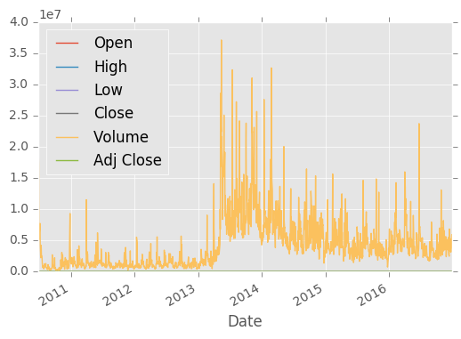
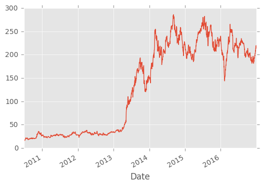

```python
import datetime as dt
import numpy as nm
import matplotlib.pyplot as plt
from matplotlib import style
import pandas as pd
import pandas_datareader.data as web
```


```python
style.use('ggplot')
# start= dt.datetime(2000,1,1)
# end= dt.datetime(2016,12,31)
 df= web.DataReader('TSLA','yahoo',start,end)
# print(df.head())

```

                     Open   High        Low      Close    Volume  Adj Close
    Date                                                                   
    2010-06-29  19.000000  25.00  17.540001  23.889999  18766300  23.889999
    2010-06-30  25.790001  30.42  23.299999  23.830000  17187100  23.830000
    2010-07-01  25.000000  25.92  20.270000  21.959999   8218800  21.959999
    2010-07-02  23.000000  23.10  18.709999  19.200001   5139800  19.200001
    2010-07-06  20.000000  20.00  15.830000  16.110001   6866900  16.110001
    


```python
#df.to_csv('tsla.csv')
```


```python
df=pd.read_csv('tsla.csv', parse_dates=True,index_col=0)
print(df.head())

```

                     Open   High        Low      Close    Volume  Adj Close
    Date                                                                   
    2010-06-29  19.000000  25.00  17.540001  23.889999  18766300  23.889999
    2010-06-30  25.790001  30.42  23.299999  23.830000  17187100  23.830000
    2010-07-01  25.000000  25.92  20.270000  21.959999   8218800  21.959999
    2010-07-02  23.000000  23.10  18.709999  19.200001   5139800  19.200001
    2010-07-06  20.000000  20.00  15.830000  16.110001   6866900  16.110001
    


```python
##Visualization
df.plot()
plt.show()
df['Adj Close'].plot()
plt.show()
print(df[['Open','High']].head())
```








                     Open   High
    Date                        
    2010-06-29  19.000000  25.00
    2010-06-30  25.790001  30.42
    2010-07-01  25.000000  25.92
    2010-07-02  23.000000  23.10
    2010-07-06  20.000000  20.00
    


```python

```
