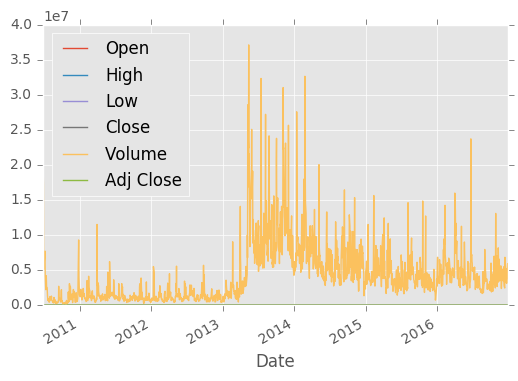
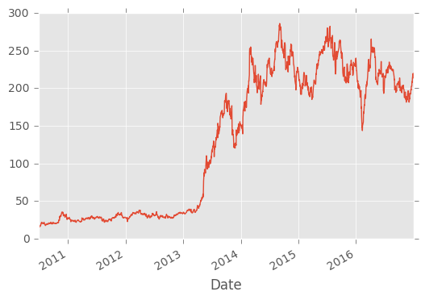
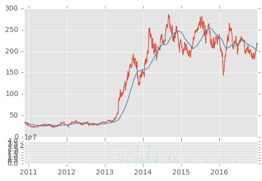

```python
import datetime as dt
import numpy as nm
import matplotlib.pyplot as plt
from matplotlib import style
import pandas as pd
import pandas_datareader.data as web
```


```python
style.use('ggplot')
# start= dt.datetime(2000,1,1)
# end= dt.datetime(2016,12,31)
 df= web.DataReader('TSLA','yahoo',start,end)
# print(df.head())

```

                     Open   High        Low      Close    Volume  Adj Close
    Date                                                                   
    2010-06-29  19.000000  25.00  17.540001  23.889999  18766300  23.889999
    2010-06-30  25.790001  30.42  23.299999  23.830000  17187100  23.830000
    2010-07-01  25.000000  25.92  20.270000  21.959999   8218800  21.959999
    2010-07-02  23.000000  23.10  18.709999  19.200001   5139800  19.200001
    2010-07-06  20.000000  20.00  15.830000  16.110001   6866900  16.110001
    


```python
#df.to_csv('tsla.csv')
```


```python
df=pd.read_csv('tsla.csv', parse_dates=True,index_col=0)
print(df.head())

```

                     Open   High        Low      Close    Volume  Adj Close
    Date                                                                   
    2010-06-29  19.000000  25.00  17.540001  23.889999  18766300  23.889999
    2010-06-30  25.790001  30.42  23.299999  23.830000  17187100  23.830000
    2010-07-01  25.000000  25.92  20.270000  21.959999   8218800  21.959999
    2010-07-02  23.000000  23.10  18.709999  19.200001   5139800  19.200001
    2010-07-06  20.000000  20.00  15.830000  16.110001   6866900  16.110001
    


```python
##Visualization
df.plot()
plt.show()
df['Adj Close'].plot()
plt.show()
print(df[['Open','High']].head())
```








                     Open   High
    Date                        
    2010-06-29  19.000000  25.00
    2010-06-30  25.790001  30.42
    2010-07-01  25.000000  25.92
    2010-07-02  23.000000  23.10
    2010-07-06  20.000000  20.00
    


```python
##3 tutorial (Manipulating and visualization)
##creating new column
df['100ma']=df['Adj Close'].rolling(window=100).mean()
print(df.head()) ##this one gives us a NaN as the moving average will start coming after the st 100 elements are formed
print(df.tail())
df.dropna(inplace=True)

```

                     Open   High        Low      Close    Volume  Adj Close  100ma
    Date                                                                          
    2010-06-29  19.000000  25.00  17.540001  23.889999  18766300  23.889999    NaN
    2010-06-30  25.790001  30.42  23.299999  23.830000  17187100  23.830000    NaN
    2010-07-01  25.000000  25.92  20.270000  21.959999   8218800  21.959999    NaN
    2010-07-02  23.000000  23.10  18.709999  19.200001   5139800  19.200001    NaN
    2010-07-06  20.000000  20.00  15.830000  16.110001   6866900  16.110001    NaN
                      Open        High         Low       Close   Volume  \
    Date                                                                  
    2016-12-23  208.000000  213.449997  207.710007  213.339996  4670500   
    2016-12-27  214.880005  222.250000  214.419998  219.529999  5915700   
    2016-12-28  221.529999  223.800003  217.199997  219.740005  3782500   
    2016-12-29  218.559998  219.199997  214.119995  214.679993  4045000   
    2016-12-30  216.300003  217.500000  211.679993  213.690002  4642600   
    
                 Adj Close     100ma  
    Date                              
    2016-12-23  213.339996  202.6190  
    2016-12-27  219.529999  202.5082  
    2016-12-28  219.740005  202.4053  
    2016-12-29  214.679993  202.2905  
    2016-12-30  213.690002  202.1366  
    


```python

df['100ma']=df['Adj Close'].rolling(window=100,min_periods=0).mean()##using this we can firnd the moving average of the numbers even before top100
print(df.head())
```

                     Open       High        Low      Close   Volume  Adj Close  \
    Date                                                                         
    2010-11-17  30.200001  30.750000  28.610001  29.490000   750000  29.490000   
    2010-11-18  30.670000  30.740000  28.920000  29.889999   956100  29.889999   
    2010-11-19  30.160000  31.370001  29.700001  30.990000  1150500  30.990000   
    2010-11-22  31.570000  33.450001  31.500000  33.400002  1529700  33.400002   
    2010-11-23  33.290001  35.680000  32.189999  34.570000  1577800  34.570000   
    
                    100ma  
    Date                   
    2010-11-17  29.490000  
    2010-11-18  29.689999  
    2010-11-19  30.123333  
    2010-11-22  30.942500  
    2010-11-23  31.668000  
    


```python
ax1=plt.subplot2grid((6,1),(0,0),rowspan=5,colspan=1)
ax2=plt.subplot2grid((6,1),(5,0),rowspan=1,colspan=1, sharex=ax1)

ax1.plot(df.index,df['Adj Close'])
ax1.plot(df.index,df['100ma'])
ax2.bar(df.index,df['Volume'])

plt.show()

```





```python

```
