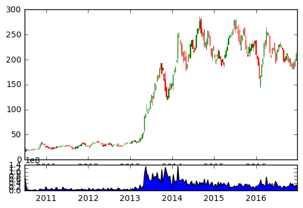

```python
##resampling our data
import datetime as dt
import numpy as nm
import matplotlib.pyplot as plt
from matplotlib import style
from matplotlib.finance import candlestick_ohlc
import matplotlib.dates as mdates
import pandas as pd
import pandas_datareader.data as web
```


```python

df=pd.read_csv('tsla.csv',parse_dates=True,index_col=0)

##resampling and making new data frame
df_ohlc=df['Adj Close'].resample('10D').ohlc()
##ohlc is open high low close
df_volume=df['Volume'].resample('10D').sum()

##reset the index so that dates can be accomodated in the column
df_ohlc.reset_index(inplace=True)
df_ohlc['Date']=df_ohlc['Date'].map(mdates.date2num)

ax1=plt.subplot2grid((6,1),(0,0),rowspan=5,colspan=1)
ax2=plt.subplot2grid((6,1),(5,0),rowspan=1,colspan=1, sharex=ax1)
ax1.xaxis_date()

candlestick_ohlc(ax1,df_ohlc.values,width=2,colorup='g')
ax2.fill_between(df_volume.index.map(mdates.date2num),df_volume.values,0)

plt.show()
```





```python

```


```python

```


```python

```
